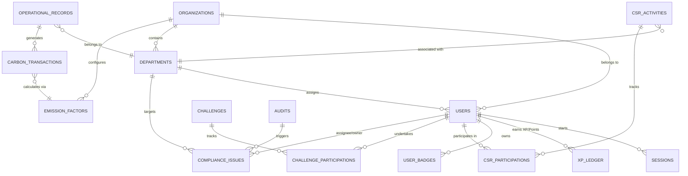

# EcoSphere ESG Management Platform — Enterprise MongoDB Schema & Data Model

This document specifies the official MongoDB schema and data model for the **EcoSphere ESG (Environmental, Social, and Governance) Management Platform**. Designed for a multi-tenant, enterprise-grade architecture, this data model supports real-time carbon tracking, compliance audits, gamification, and department-level ESG reporting.

---

## 1. System Architecture & Database Design Principles

### 1.1 Multi-Tenancy (SaaS) Architecture
- **Logical Isolation:** Every tenant-owned document contains an `org_id` (pointing to the `organizations` collection) to enforce strict data isolation at the application layer.
- **Exceptions:** Global master data (e.g., global emission references) has a `null` or absent `org_id` and is managed by Platform Master Admins.
- **Cross-Organization Verification:** Multi-company supply chain carbon tracking is modeled via cryptographically verifiable links (`product_links`) to safely share emission data across organizations.

### 1.2 Data Integrity and Validation
- **Dynamic Enforcement:** Shape validation is enforced at the application/service layer using Pydantic models (FastAPI) and MongoDB JSON Schema Validators.
- **Temporal Consistency:** Every document includes UTC timestamps (`created_at` and `updated_at`).
- **Precision:** Carbon amounts are tracked in **kilograms of CO2 equivalent (kg CO2e)** using high-precision decimal formatting in application code. Period scopes use a sub-document structure containing `{ year, month }`.
- **Financial Fields:** Currency fields are stored as structured objects: `{ amount: Decimal, currency: String }`.

### 1.3 State Management and Rollups
- **Dynamic Derivation:** To prevent data stale-states, derived fields (e.g., challenge completion progress, parent department rollups, compliance overdue flags) are computed at query time via MongoDB Aggregation Pipelines rather than stored statically.
- **Snapshots:** Explicit exceptions are made for history-preservation (e.g., `department_scores` captures monthly performance, shielding historic records from subsequent formula adjustments or organization weight re-configurations).

---

## 2. Entity Relationship Diagram (ERD)

The following Mermaid diagram visualizes the primary relationships and reference links between core collections:



---

## 3. Core Collections (MVP Model)

### 3.1 Identity & Tenancy

#### `organizations`
Represents corporate tenants, platform administration nodes, or NGO actors.
```json
{
  "_id": "ObjectId",
  "name": "Acme Corporation",
  "type": "corporate", // "platform" | "corporate" | "ngo"
  "status": "active",  // "active" | "suspended"
  "settings": {
    "esg_weights": { "e": 40, "s": 30, "g": 30 },
    "auto_emission_calculation": true,
    "require_csr_evidence": true,
    "badge_auto_award": true,
    "email_compliance_alerts": true
  },
  "created_at": "ISODate",
  "updated_at": "ISODate"
}
```
* **Indexes:** None primary beyond `_id`.

#### `users`
Represents employees, sustainability leads, or administrative roles.
```json
{
  "_id": "ObjectId",
  "org_id": "ObjectId",
  "email": "user@acme.com",
  "password_hash": "$argon2id$v=19$m=65536,t=3,p=4$...", 
  "full_name": "Jane Doe",
  "department_id": "ObjectId", 
  "roles": [
    { "role": "org_admin" }
  ],
  "status": "active", // "pending_verification" | "active" | "disabled"
  "xp_total": 1250,
  "points_balance": 350,
  "created_at": "ISODate",
  "updated_at": "ISODate"
}
```
* **Roles Enum:** `master_admin`, `sub_admin`, `org_admin`, `dept_head`, `employee`, `ngo_member`.
* **Indexes:** 
  - `{ "email": 1 }` (Unique)
  - `{ "org_id": 1, "department_id": 1 }`
  - `{ "org_id": 1, "xp_total": -1 }` (Leaderboard optimization)

#### `sessions`
Tracks active user authentication states via refresh tokens.
```json
{
  "_id": "ObjectId",
  "user_id": "ObjectId",
  "org_id": "ObjectId",
  "token_hash": "64_char_sha256_hash",
  "expires_at": "ISODate",
  "last_used_at": "ISODate",
  "ip": "192.168.1.1",
  "user_agent": "Mozilla/5.0 ...",
  "revoked_at": null,
  "created_at": "ISODate"
}
```
* **Indexes:** 
  - `{ "token_hash": 1 }` (Unique)
  - `{ "user_id": 1 }`
  - `{ "expires_at": 1 }` (TTL index for automatic deletion)

#### `otps`
Stores transient One-Time Passwords for authentication and verification.
```json
{
  "_id": "ObjectId",
  "email": "user@acme.com",
  "code_hash": "sha256_hash",
  "purpose": "login", // "register" | "login" | "password_reset"
  "attempts": 0,
  "consumed_at": null,
  "expires_at": "ISODate",
  "created_at": "ISODate"
}
```
* **Indexes:** 
  - `{ "email": 1, "purpose": 1 }`
  - `{ "expires_at": 1 }` (TTL index: ~10 minutes expiration)

---

### 3.2 Master Data

#### `departments`
Organizes tenants into recursive hierarchical trees using both a parent reference and material path (`ancestors`).
```json
{
  "_id": "ObjectId",
  "org_id": "ObjectId",
  "name": "Manufacturing Dept",
  "code": "MFG",
  "parent_id": "ObjectId", // Null for root departments
  "ancestors": ["ObjectId"], // Ordered array: root -> parent
  "head_user_id": "ObjectId",
  "employee_count": 142,
  "status": "active", // "active" | "archived"
  "created_at": "ISODate",
  "updated_at": "ISODate"
}
```
* **Indexes:** 
  - `{ "org_id": 1, "parent_id": 1, "name": 1 }` (Unique constraint per tier)
  - `{ "org_id": 1, "ancestors": 1 }`

#### `categories`
Used to categorize CSR events and gamification challenges.
```json
{
  "_id": "ObjectId",
  "org_id": "ObjectId",
  "name": "Waste Reduction",
  "type": "csr_activity", // "csr_activity" | "challenge"
  "status": "active",
  "created_at": "ISODate",
  "updated_at": "ISODate"
}
```
* **Indexes:** `{ "org_id": 1, "type": 1, "name": 1 }` (Unique)

#### `emission_factors`
Customizable coefficients to map business operations to carbon values automatically.
```json
{
  "_id": "ObjectId",
  "org_id": "ObjectId",
  "activity": "purchase", // "purchase" | "manufacturing" | "expense" | "fleet"
  "item": "diesel_litre",
  "label": "Diesel (per Litre)",
  "factor_kg_per_unit": 2.68,
  "unit_label": "litres",
  "source": "EPA GHG Emission Factors 2025",
  "year": 2026,
  "status": "active", // "active" | "retired"
  "created_at": "ISODate",
  "updated_at": "ISODate"
}
```
* **Indexes:** `{ "org_id": 1, "activity": 1, "item": 1, "year": -1 }`

#### `badges`
Gamification assets that unlock when users reach milestones.
```json
{
  "_id": "ObjectId",
  "org_id": null, // null for platform-wide; ObjectId for tenant-specific
  "name": "Carbon Champion",
  "description": "Achieve a cumulative carbon reduction of 500kg.",
  "icon_file_id": "ObjectId",
  "unlock_rule": {
    "metric": "xp_total", // "xp_total" | "challenges_completed" | "csr_approved" | "trainings_completed"
    "threshold": 1000
  },
  "status": "active",
  "created_at": "ISODate",
  "updated_at": "ISODate"
}
```

#### `rewards`
Catalog of tangible/intangible rewards exchangeable for points.
```json
{
  "_id": "ObjectId",
  "org_id": "ObjectId",
  "name": "Eco-friendly Coffee Mug",
  "description": "Reusable insulated coffee cup made of biodegradable bamboo fiber.",
  "image_file_id": "ObjectId",
  "cost_points": 200,
  "stock": 45,
  "status": "active",
  "created_at": "ISODate",
  "updated_at": "ISODate"
}
```

#### `policies`
Sustainability and governance guidelines that users must read and acknowledge.
```json
{
  "_id": "ObjectId",
  "org_id": "ObjectId",
  "policy_group_id": "ObjectId", // Consistent across revisions
  "version": 1,
  "title": "Corporate Waste Disposal Policy v1",
  "body": "Detailed rules on electronic and organic waste sorting...",
  "file_id": "ObjectId", // Optional attachment file reference
  "effective_date": "ISODate",
  "status": "published", // "draft" | "published" | "retired"
  "created_by": "ObjectId",
  "created_at": "ISODate",
  "updated_at": "ISODate"
}
```
* **Indexes:** `{ "org_id": 1, "policy_group_id": 1, "version": -1 }`

#### `sustainability_goals`
Platform-tracked targets for carbon or resource reduction.
```json
{
  "_id": "ObjectId",
  "org_id": "ObjectId",
  "department_id": "ObjectId", // Null indicates organization-wide goal
  "name": "Cut Scope 1 Fleet Emissions",
  "metric": "total_carbon_kg",
  "baseline_value": 50000,
  "target_value": 35000,
  "unit": "kg CO2e",
  "start": { "year": 2026, "month": 1 },
  "deadline": { "year": 2026, "month": 12 },
  "status": "on_track", // "active" | "on_track" | "completed" | "missed"
  "created_by": "ObjectId",
  "created_at": "ISODate",
  "updated_at": "ISODate"
}
```

---

### 3.3 Transactional Data

#### `operational_records`
Input events imported from ERP systems representing carbon-generating business activities.
```json
{
  "_id": "ObjectId",
  "org_id": "ObjectId",
  "department_id": "ObjectId",
  "op_type": "purchase", // "purchase" | "manufacturing" | "expense" | "fleet"
  "description": "Procured 500 liters of diesel for logistics fleet",
  "quantity": 500,
  "unit_label": "litres",
  "amount": { "amount": 1150.0, "currency": "USD" },
  "occurred_at": "ISODate",
  "created_by": "ObjectId",
  "created_at": "ISODate",
  "updated_at": "ISODate"
}
```
* **Indexes:** `{ "org_id": 1, "op_type": 1, "occurred_at": -1 }`

#### `carbon_transactions`
The consolidated ledger recording all emissions (positive) and offsets (negative). Derived directly from operational records.
```json
{
  "_id": "ObjectId",
  "org_id": "ObjectId",
  "department_id": "ObjectId", // Null indicates org-level adjustments
  "period": { "year": 2026, "month": 7 },
  "amount_kg": 1340,
  "source_type": "purchase", // "purchase"|"manufacturing"|"expense"|"fleet"|"manual"|"offset_purchase"...
  "source_ref": {
    "collection": "operational_records",
    "id": "ObjectId"
  },
  "calculation": {
    "factor_id": "ObjectId",
    "factor_value": 2.68,
    "inputs": { "quantity": 500 },
    "is_approximation": false
  },
  "note": "Automated conversion using default diesel factor.",
  "created_by": "ObjectId",
  "created_at": "ISODate",
  "updated_at": "ISODate"
}
```
* **Indexes:** 
  - `{ "org_id": 1, "period.year": 1, "period.month": 1 }`
  - `{ "org_id": 1, "department_id": 1, "period.year": 1 }`
  - `{ "source_ref.collection": 1, "source_ref.id": 1 }`

#### `csr_activities`
Corporate Social Responsibility activities set up by sustainability managers.
```json
{
  "_id": "ObjectId",
  "org_id": "ObjectId",
  "department_id": "ObjectId",
  "title": "Community Reforestation Drive",
  "description": "Planting native trees at the city park.",
  "category_id": "ObjectId",
  "activity_date": "ISODate",
  "location": "Greenwood Park",
  "evidence_required": true,
  "points_reward": 100,
  "xp_reward": 250,
  "status": "open", // "planned" | "open" | "completed" | "cancelled"
  "created_by": "ObjectId",
  "created_at": "ISODate",
  "updated_at": "ISODate"
}
```

#### `csr_participations`
Binds users to CSR activities, serving as the approval mechanism for gamification rewards.
```json
{
  "_id": "ObjectId",
  "org_id": "ObjectId",
  "activity_id": "ObjectId",
  "user_id": "ObjectId",
  "department_id": "ObjectId",
  "proof_file_ids": ["ObjectId"],
  "note": "Uploaded photo of team planting saplings.",
  "status": "submitted", // "joined" | "submitted" | "approved" | "rejected"
  "points_earned": null,
  "completed_at": null,
  "reviewed_by": null,
  "reviewed_at": null,
  "review_note": null,
  "created_at": "ISODate",
  "updated_at": "ISODate"
}
```
* **Indexes:** 
  - `{ "activity_id": 1, "user_id": 1 }` (Unique constraint)
  - `{ "org_id": 1, "status": 1 }` (Speeds up approval queue dashboard)

#### `diversity_metrics`
Self-reported sociological matrices to satisfy Social (S) reporting goals.
```json
{
  "_id": "ObjectId",
  "org_id": "ObjectId",
  "department_id": "ObjectId",
  "period": { "year": 2026, "month": 6 },
  "dimension": "gender", // "gender" | "age_band" | "disabled"
  "breakdown": {
    "female": 45,
    "male": 52,
    "other_undisclosed": 3
  },
  "reported_by": "ObjectId",
  "created_at": "ISODate",
  "updated_at": "ISODate"
}
```
* **Indexes:** `{ "org_id": 1, "department_id": 1, "dimension": 1, "period.year": 1, "period.month": 1 }` (Unique)

#### `trainings` & `training_completions`
Compliance and capability logs for ESG training modules.
```json
// trainings
{
  "_id": "ObjectId",
  "org_id": "ObjectId",
  "title": "Anti-Bribery and Anti-Corruption Rules",
  "description": "Required review of corporate ethics standards.",
  "category": "governance",
  "status": "active",
  "created_by": "ObjectId",
  "created_at": "ISODate",
  "updated_at": "ISODate"
}

// training_completions
{
  "_id": "ObjectId",
  "org_id": "ObjectId",
  "training_id": "ObjectId",
  "user_id": "ObjectId",
  "department_id": "ObjectId",
  "completed_at": "ISODate",
  "score": 95,
  "created_at": "ISODate"
}
```
* **Indexes (Completions):** `{ "training_id": 1, "user_id": 1 }` (Unique)

#### `policy_acknowledgements`
Auditable logs verifying that employees reviewed updated organizational policies.
```json
{
  "_id": "ObjectId",
  "org_id": "ObjectId",
  "policy_id": "ObjectId",
  "policy_group_id": "ObjectId",
  "version": 1,
  "user_id": "ObjectId",
  "acknowledged_at": "ISODate"
}
```
* **Indexes:** `{ "policy_id": 1, "user_id": 1 }` (Unique)

#### `audits`
Tracks periodic structural verification operations (both internal self-assessments and external ISO audits).
```json
{
  "_id": "ObjectId",
  "org_id": "ObjectId",
  "department_id": "ObjectId",
  "title": "Annual Scope 2 Verification Audit",
  "audit_type": "external", // "internal" | "external"
  "auditor_name": "SGS Certification Services",
  "scheduled_date": "ISODate",
  "completed_date": "ISODate",
  "findings": "Some discrepancies noted in utility meter tracking for warehouse B.",
  "report_file_id": "ObjectId",
  "status": "under_review", // "scheduled" | "in_progress" | "under_review" | "completed"
  "created_by": "ObjectId",
  "created_at": "ISODate",
  "updated_at": "ISODate"
}
```

#### `compliance_issues`
Tasks linked directly to auditor findings or ESG requirements requiring operational resolution.
```json
{
  "_id": "ObjectId",
  "org_id": "ObjectId",
  "department_id": "ObjectId",
  "audit_id": "ObjectId", // Nullable if created independently
  "title": "Recalibrate utility meters",
  "description": "Meters are reading high. Requires certified technician maintenance.",
  "severity": "high", // "low" | "medium" | "high" | "critical"
  "owner_user_id": "ObjectId", // Explicit individual responsibility
  "due_date": "ISODate",
  "status": "in_progress", // "open" | "in_progress" | "resolved" | "closed"
  "resolution_note": null,
  "resolved_at": null,
  "created_by": "ObjectId",
  "created_at": "ISODate",
  "updated_at": "ISODate"
}
```
* **Indexes:** `{ "org_id": 1, "status": 1, "due_date": 1 }`
* **Note on Overdue State:** Computed dynamically via query comparison: `status in ['open', 'in_progress'] AND due_date < NOW()`.

---

### 3.4 Gamification System

#### `challenges`
Competitive tasks configured to drive behavioral improvements.
```json
{
  "_id": "ObjectId",
  "org_id": "ObjectId",
  "title": "Zero Single-use Plastic Month",
  "description": "Avoid purchasing and using plastic bottles or cutlery at work.",
  "category_id": "ObjectId",
  "difficulty": "medium", // "easy" | "medium" | "hard"
  "xp_reward": 300,
  "points_reward": 100,
  "evidence_required": true,
  "starts_at": "ISODate",
  "deadline": "ISODate",
  "status": "active", // "draft" | "active" | "under_review" | "completed" | "archived"
  "created_by": "ObjectId",
  "created_at": "ISODate",
  "updated_at": "ISODate"
}
```
* **Indexes:** `{ "org_id": 1, "status": 1 }`

#### `challenge_participations`
Links users to ongoing challenges, mapping progress and certifying achievements.
```json
{
  "_id": "ObjectId",
  "org_id": "ObjectId",
  "challenge_id": "ObjectId",
  "user_id": "ObjectId",
  "department_id": "ObjectId",
  "progress": 45, // 0 to 100 percentage
  "proof_file_ids": ["ObjectId"],
  "status": "joined", // "joined" | "submitted" | "approved" | "rejected"
  "xp_awarded": null,
  "completed_at": null,
  "reviewed_by": null,
  "reviewed_at": null,
  "certificate": {
    "file_id": "ObjectId",
    "share_token": "unique_secure_token",
    "issued_at": "ISODate"
  },
  "created_at": "ISODate",
  "updated_at": "ISODate"
}
```
* **Indexes:** 
  - `{ "challenge_id": 1, "user_id": 1 }` (Unique)
  - `{ "certificate.share_token": 1 }` (Unique, sparse)

#### `xp_ledger`
Immutable ledger capturing every point adjustment or reputation change. Acts as the Single Source of Truth for gamification status.
```json
{
  "_id": "ObjectId",
  "org_id": "ObjectId",
  "user_id": "ObjectId",
  "department_id": "ObjectId", // User's department at time of earn, preserving historical rollups
  "xp_delta": 300,
  "points_delta": 100,
  "reason": "challenge_completed", // "challenge_completed" | "csr_approved" | "training_completed" | "badge_awarded" | "reward_redeemed" | "admin_adjustment"
  "source_ref": {
    "collection": "challenge_participations",
    "id": "ObjectId"
  },
  "created_at": "ISODate"
}
```
* **Indexes:**
  - `{ "user_id": 1, "created_at": -1 }`
  - `{ "org_id": 1, "department_id": 1, "created_at": -1 }`

#### `user_badges`
Map collection for users and unlocked badges.
```json
{
  "_id": "ObjectId",
  "org_id": "ObjectId",
  "user_id": "ObjectId",
  "badge_id": "ObjectId",
  "awarded_at": "ISODate",
  "source_ref": {
    "collection": "xp_ledger",
    "id": "ObjectId"
  }
}
```
* **Indexes:** `{ "user_id": 1, "badge_id": 1 }` (Unique - prevents concurrent double-awarding of badges)

#### `reward_redemptions`
Logs user transactions exchanging earned points for rewards.
```json
{
  "_id": "ObjectId",
  "org_id": "ObjectId",
  "reward_id": "ObjectId",
  "user_id": "ObjectId",
  "points_spent": 200,
  "status": "redeemed", // "redeemed" | "fulfilled" | "cancelled"
  "created_at": "ISODate",
  "updated_at": "ISODate"
}
```
* **Concurrence & Safety:** Debiting user points and decrementing reward stock are guarded via MongoDB transactions to avoid race conditions:
  ```js
  // 1. Decrement active stock
  db.rewards.findOneAndUpdate({_id: reward_id, stock: {$gte: 1}, status: "active"}, {$inc: {stock: -1}})
  // 2. Decrement user balance
  db.users.findOneAndUpdate({_id: user_id, points_balance: {$gte: cost}}, {$inc: {points_balance: -cost}})
  ```

---

### 3.5 System & Diagnostic Data

#### `department_scores`
Static monthly snapshot capturing ESG performance calculations to prevent historical drift.
```json
{
  "_id": "ObjectId",
  "org_id": "ObjectId",
  "department_id": "ObjectId", // Null represents consolidated organization-wide score
  "period": { "year": 2026, "month": 6 },
  "e_score": 82,
  "s_score": 75,
  "g_score": 90,
  "total_score": 81.7, // Weighted based on esg_weights setting
  "weights_used": { "e": 40, "s": 30, "g": 30 },
  "components": {
    "emissions_reduction_pct": 12,
    "training_completion_pct": 89,
    "open_compliance_issues": 1
  },
  "computed_at": "ISODate"
}
```
* **Indexes:** `{ "org_id": 1, "department_id": 1, "period.year": 1, "period.month": 1 }` (Unique)

#### `notifications`
System logs powering local user notifications and triggering external messaging APIs.
```json
{
  "_id": "ObjectId",
  "org_id": "ObjectId",
  "user_id": "ObjectId",
  "type": "compliance_issue_raised",
  "title": "Action Required: Overdue Audit Resolution",
  "body": "Compliance issue 'Recalibrate utility meters' has passed its due date.",
  "source_ref": {
    "collection": "compliance_issues",
    "id": "ObjectId"
  },
  "channel": ["in_app", "email"],
  "read_at": null,
  "emailed_at": null,
  "created_at": "ISODate"
}
```
* **Indexes:** `{ "user_id": 1, "read_at": 1, "created_at": -1 }`

#### `files`
Abstracts files uploaded to storage engines. Tracks keys relative to storage partitions rather than absolute URLs.
```json
{
  "_id": "ObjectId",
  "org_id": "ObjectId",
  "uploaded_by": "ObjectId",
  "backend": "local", // "local" | "b2" (Backblaze)
  "storage_key": "org/12345/csr/88f28c-9a11.jpg", // Independent of server path
  "original_name": "evidence_photo.jpg",
  "mime_type": "image/jpeg",
  "size_bytes": 1024500,
  "purpose": "csr_proof", // "csr_proof" | "challenge_proof" | "policy_doc" | "audit_report" | "certificate" | "badge_icon" | "reward_image" | "project_doc"
  "created_at": "ISODate"
}
```

---

## 4. Phase 2 Collections (Post-MVP / Advanced Modeling)

The following schemas are designed for advanced corporate features, lifecycle supply-chain integration, and global tracking.

### 4.1 Global References & Commuting Profiles

#### `carbon_reference`
A shared reference directory maps common products and activities to carbon intensities globally.
```json
{
  "_id": "ObjectId",
  "country": "US", // ISO 3166-1 alpha-2
  "city": null, // Null indicates country-wide average
  "product_category": "electricity",
  "product_name": "coal_generation", // Null indicates general category value
  "description": "Grid output carbon value for coal production",
  "year": 2026,
  "carbon_value": 0.95,
  "unit": "per_kwh", // "per_unit" | "per_kg" | "per_kwh"
  "source": "EIA International Carbon Statistics",
  "updated_by": "ObjectId",
  "created_at": "ISODate",
  "updated_at": "ISODate"
}
```
* **Indexes:** `{ "country": 1, "city": 1, "product_category": 1, "product_name": 1, "year": 1 }` (Unique)
* **Lookup Strategy:** Dynamic fallbacks execute in this priority order:
  1. `country` + `city` + `product_category` + `product_name` (Target year)
  2. `country` + `product_category` + `product_name`
  3. `country` + `product_category`
  4. `product_category`
  *If lookup hits step 2, 3, or 4, `is_approximation` flag is written as `true` to the transaction.*

#### `reference_value_history`
Tracks audits and value modifications across references.
```json
{
  "_id": "ObjectId",
  "reference_id": "ObjectId",
  "ref_collection": "carbon_reference", // "carbon_reference" | "city_profiles"
  "old_value": 0.95,
  "new_value": 0.89,
  "old_source": "EIA Data 2025",
  "new_source": "EIA Data 2026 Revision",
  "changed_by": "ObjectId",
  "changed_at": "ISODate"
}
```

#### `city_profiles`
Details localized transit indexes and regional resource averages.
```json
{
  "_id": "ObjectId",
  "country": "IN",
  "city": "Mumbai",
  "year": 2026,
  "avg_commute_km_per_day": 24,
  "transport_mix": [
    { "mode": "rail", "share": 0.65, "factor_kg_per_km": 0.012 },
    { "mode": "car", "share": 0.15, "factor_kg_per_km": 0.16 },
    { "mode": "bus", "share": 0.20, "factor_kg_per_km": 0.035 }
  ],
  "grid_renewable_pct": 0.22,
  "grid_factor_kg_per_kwh": 0.82,
  "electricity_tariff_per_kwh": { "amount": 0.09, "currency": "USD" },
  "working_days_per_month": 22,
  "source": "Local Municipality Transit Audit",
  "updated_by": "ObjectId",
  "created_at": "ISODate",
  "updated_at": "ISODate"
}
```
* **Indexes:** `{ "country": 1, "city": 1, "year": 1 }` (Unique)

---

### 4.2 Facilities & Physical Footprints

#### `facilities` & `facility_readings`
Tracks properties and monthly activity readings for offices, warehouses, and physical locations.
```json
// facilities
{
  "_id": "ObjectId",
  "org_id": "ObjectId",
  "department_id": "ObjectId",
  "name": "APAC HQ",
  "country": "SG",
  "city": "Singapore",
  "employee_count": 850,
  "status": "active",
  "created_at": "ISODate",
  "updated_at": "ISODate"
}

// facility_readings
{
  "_id": "ObjectId",
  "org_id": "ObjectId",
  "facility_id": "ObjectId",
  "department_id": "ObjectId",
  "period": { "year": 2026, "month": 7 },
  "inputs": {
    "electricity_kwh": 45000,
    "electricity_bill": null,
    "employee_count_override": 820
  },
  "computed": {
    "commute_kg": 9840,
    "electricity_kg": 18225,
    "total_kg": 28065,
    "city_profile_id": "ObjectId",
    "assumptions": { "commute_mix_used": true }
  },
  "created_at": "ISODate",
  "updated_at": "ISODate"
}
```
* **Indexes (Readings):** `{ "facility_id": 1, "period.year": 1, "period.month": 1 }` (Unique)
* **Design Note:** Updates to `facility_readings` execute corresponding upserts into the unified `carbon_transactions` collection under `facility_commute` and `facility_electricity` sources.

---

### 4.3 Supply Chain & Product Life Cycle Analysis

#### `products`
Records products produced or designed by the company along with their carbon footprint.
```json
{
  "_id": "ObjectId",
  "org_id": "ObjectId",
  "department_id": "ObjectId",
  "name": "EcoSmart Thermostat Model S",
  "category": "electronics",
  "description": "Smart thermostat with recycled housing materials.",
  "production_country": "VN",
  "production_city": "Hanoi",
  "unit_price": { "amount": 149.0, "currency": "USD" },
  "carbon": {
    "per_unit_kg": 12.4,
    "reference_id": "ObjectId",
    "match_tier": 2,
    "is_approximation": true,
    "calculated_at": "ISODate"
  },
  "status": "active",
  "created_at": "ISODate",
  "updated_at": "ISODate"
}
```

#### `product_sales`
Records monthly transactional sales totals to support carbon overhead calculations.
```json
{
  "_id": "ObjectId",
  "org_id": "ObjectId",
  "product_id": "ObjectId",
  "department_id": "ObjectId",
  "period": { "year": 2026, "month": 6 },
  "units_sold": 5000,
  "unit_price": { "amount": 149.0, "currency": "USD" },
  "revenue": { "amount": 745000.0, "currency": "USD" },
  "created_at": "ISODate",
  "updated_at": "ISODate"
}
```
* **Indexes:** `{ "org_id": 1, "product_id": 1, "period.year": 1, "period.month": 1 }` (Unique)

#### `product_links`
Tracks dependencies and supply chain carbon connections between vendor entities.
```json
{
  "_id": "ObjectId",
  "requester_org_id": "ObjectId",
  "requester_product_id": "ObjectId", // Primary product
  "partner_org_id": "ObjectId", // Supplier organization
  "partner_product_id": "ObjectId", // Component product
  "link_type": "component", // "component" | "carbon_credit"
  "status": "confirmed", // "pending" | "confirmed" | "rejected" | "revoked"
  "shared": {
    "mode": "partner_per_unit_carbon",
    "value_kg": 3.45,
    "snapshot_at": "ISODate"
  },
  "requested_by": "ObjectId",
  "responded_by": "ObjectId",
  "responded_at": "ISODate",
  "created_at": "ISODate",
  "updated_at": "ISODate"
}
```
* **Indexes:** `{ "requester_product_id": 1, "partner_product_id": 1 }` (Unique)

#### `overhead_allocations`
Captures carbon allocations allocated to specific product outputs based on relative revenue contributions.
```json
{
  "_id": "ObjectId",
  "org_id": "ObjectId",
  "department_id": "ObjectId",
  "period": { "year": 2026, "month": 6 },
  "overhead_total_kg": 15000, // Total office & support emissions
  "revenue_total": { "amount": 1000000.0, "currency": "USD" },
  "lines": [
    {
      "product_id": "ObjectId",
      "revenue": { "amount": 745000.0, "currency": "USD" },
      "revenue_share": 0.745,
      "allocated_kg": 11175
    }
  ],
  "status": "current", // "current" | "superseded"
  "run_by": "ObjectId",
  "created_at": "ISODate"
}
```
* **Allocation Method:** Allocated via exact **revenue contribution ratio**. If an allocation period yields zero revenue, the overhead remains unallocated (flagged as exception) to maintain mathematical accuracy.

---

### 4.4 Carbon Credit Marketplace

#### `carbon_credit_projects`
Register environmental projects verified to issue tradeable carbon offsets.
```json
{
  "_id": "ObjectId",
  "org_id": "ObjectId", // NGO org
  "title": "Sahyadri Reforestation Initiative",
  "description": "Restoring native forest cover in Western Ghats, India.",
  "country": "IN",
  "city": "Pune",
  "project_type": "reforestation",
  "document_file_ids": ["ObjectId"],
  "estimated_credits_tonnes": 50000,
  "status": "approved", // "draft" | "submitted" | "under_review" | "approved" | "rejected"
  "reviewed_by": "ObjectId",
  "reviewed_at": "ISODate",
  "review_note": "Verified by Gold Standard documentation.",
  "created_by": "ObjectId",
  "created_at": "ISODate",
  "updated_at": "ISODate"
}
```

#### `credit_listings`
Market offers of credits ready for purchasing.
```json
{
  "_id": "ObjectId",
  "org_id": "ObjectId", // Seller
  "project_id": "ObjectId",
  "price_per_credit": { "amount": 15.0, "currency": "USD" },
  "credits_total": 10000,
  "credits_available": 7500,
  "vintage_year": 2025,
  "status": "active", // "active" | "sold_out" | "withdrawn"
  "created_at": "ISODate",
  "updated_at": "ISODate"
}
```

#### `credit_purchases`
Immutable logs documenting transactions. Purchases trigger negative entries in the buyer's `carbon_transactions` ledger.
```json
{
  "_id": "ObjectId",
  "listing_id": "ObjectId",
  "project_id": "ObjectId",
  "seller_org_id": "ObjectId",
  "buyer_org_id": "ObjectId",
  "quantity_tonnes": 250,
  "price_per_credit": { "amount": 15.0, "currency": "USD" },
  "total": { "amount": 3750.0, "currency": "USD" },
  "status": "completed", // "completed" | "cancelled"
  "applied_entry_id": "ObjectId", // Maps to the resulting negative carbon transaction
  "created_at": "ISODate"
}
```
* **Conversion Factor:** 1 Credit = 1 Tonne (1,000 kg) CO2e.
* **Safety Mechanism:** Avoids double-selling via atomic validation checkout commands:
  ```js
  db.credit_listings.findOneAndUpdate(
    { _id: listing_id, status: "active", credits_available: { $gte: qty } },
    { $inc: { credits_available: -qty } }
  )
  ```
